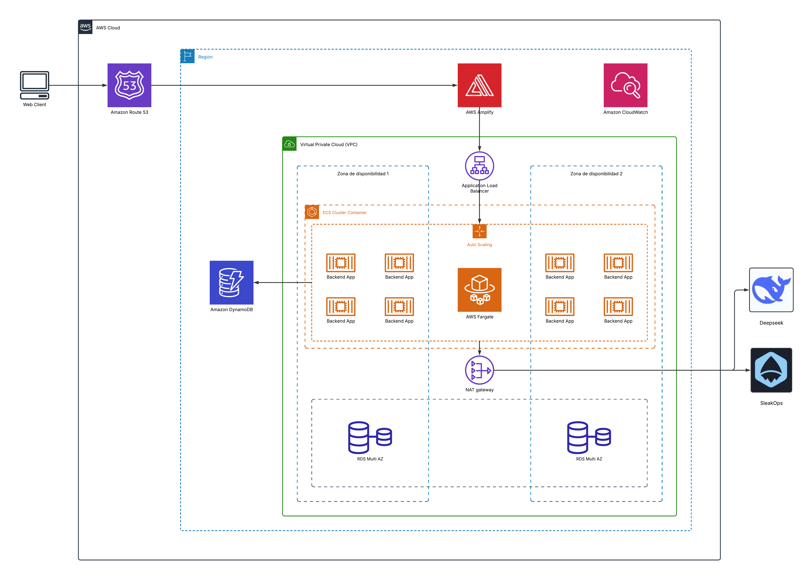

# Diagrama de Arquitectura

Esta arquitectura busca cumplir con todos los requisitos técnicos solicitados para esta prueba, enfocándose en alta disponibilidad, escalabilidad, desacoplamiento y uso eficiente de los servicios distribuidos en AWS.

## Descripción de la arquitectura

### 🧱 Cargas variables

La arquitectura incluye un **Application Load Balancer (ALB)** que distribuye el tráfico entrante entre múltiples instancias backend desplegadas con **AWS Fargate**. Además, un grupo de **Auto Scaling** permite escalar horizontalmente el número de contenedores en función de la demanda, garantizando así una respuesta dinámica ante picos o caídas de tráfico.

### ♻️ Alta disponibilidad

Los servicios backend están distribuidos entre **dos zonas de disponibilidad (AZs)**, lo que asegura **redundancia ante fallos**. La base de datos relacional (Amazon RDS) está desplegada en modo **Multi-AZ**, garantizando replicación automática y conmutación por error sin interrupciones.

### 🌐 Frontend en JavaScript

El frontend está construido con un framework JavaScript (por ejemplo, Astro) y desplegado en **AWS Amplify**, lo que permite integración continua (CI/CD), hosting globalmente distribuido y gestión automática del contenido estático.

### ⚙️ Backend con bases de datos relacional y no relacional

El backend corre dentro de contenedores **serverless en Fargate**, orquestados por **ECS**. Este servicio accede a:
* **Amazon RDS** como base de datos relacional (ej: MySQL), ideal para datos estructurados.
* **Amazon DynamoDB** como base NoSQL, ideal para datos flexibles o de alta frecuencia de acceso.

### 🔗 Consumo de microservicios externos

El backend se comunica con dos microservicios externos, representados como **Deepseek** y **SleakOps** en el diagrama. Estos pueden corresponder a servicios de autenticación, analítica o procesamiento de pagos. Para acceder a ellos de forma segura, los contenedores utilizan un **NAT Gateway**, ubicado en la subred pública, que permite salida a Internet sin exposición directa.

## ☁️ Servicios clave utilizados

* **Amazon Route 53**: DNS global para enrutar tráfico.
* **AWS Amplify**: Hosting y despliegue continuo del frontend.
* **Application Load Balancer (ALB)**: Distribución del tráfico al backend.
* **Amazon ECS + Fargate**: Contenedores sin gestión de servidores.
* **Auto Scaling**: Ajuste dinámico según la carga.
* **Amazon RDS (Multi-AZ)**: Base de datos relacional con alta disponibilidad.
* **Amazon DynamoDB**: Base de datos NoSQL escalable.
* **Amazon CloudWatch**: Monitoreo y centralización de logs.
* **NAT Gateway**: Conectividad segura hacia servicios externos.

📄 Puedes ver la descripción completa en este [documento PDF](./pdf/arquitectura_aws.pdf).

